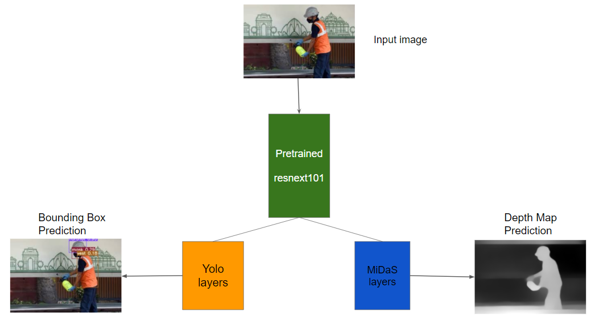

# YOLO - MiDaS with Shared Backbone

Combine YOLOv3 with MiDaS with a single Resnext101 backbone. The idea is to use a single feature extractor for two different applications, in this case, Object detection and Monocular Depth Estimation.



The model architecture change can be seen in `model/mde_net.py`

## Requirements

Install the required packages using:
```bash
pip install -r requirements.txt
```

## Usage

### Training

1. Download the Construction Safety Gear Data from [Roboflow](https://universe.roboflow.com/siabar/ppe-dataset-for-workplace-safety).
2. Place the data inside the `data/customdata/custom.data` folder.
3. Run the training script:
    ```bash
    python train.py --weights /app/yolo-midas-master/weights/model-f46da743.pt --data /app/yolo-midas-master/data/customdata/custom.data --batch 8 --cache --cfg /app/yolo-midas-master/cfg/mde.cfg --epochs 50 --img-size 512
    ```
4. Refer to the config file `cfg/mde.cfg` to change the network configuration and freeze different branches.

### Inference

1. Download the weights from [MiDaS releases](https://github.com/isl-org/MiDaS/releases/tag/v2) and place them under the `weights` folder.
2. Place the images for inference inside the `input` folder.
3. Run the inference script:
    ```bash
    python detect.py --source input --conf-thres 0.1 --output output --weights /app/yolo-midas-master/weights/model-f46da743.pt
    ```
4. The inferred images will be stored inside the `output` folder.

## References

- [YOLOv3](https://github.com/ultralytics/yolov3)
- [MiDaS](https://github.com/intel-isl/MiDaS)
- [Original repo](https://github.com/sarvan0506/yolo-midas)

